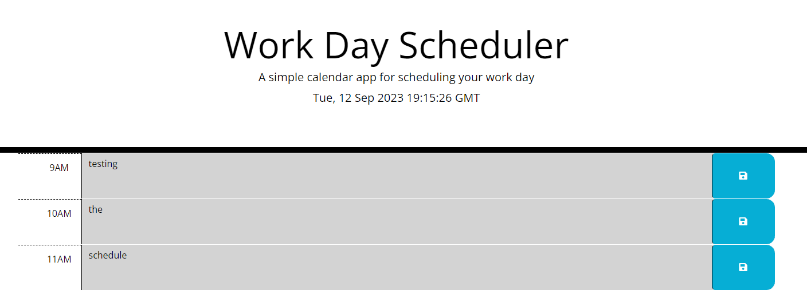

# Workday-Scheduler

Create a simple calendar application that allows a user to save events for each hour of the day by modifying starter code.

## Usage

Enter text into the hourly planner, then press the save button to ensure your entry is preserved when you refresh the page. Additionally, the color of the hourly blocks will adjust based on the current time of day.

#### Image

Deployed link: https://balalsaleh.github.io/workday-Scheduler/
